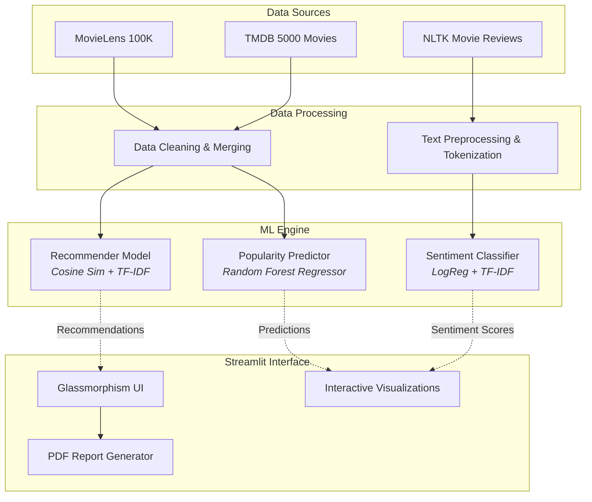

<div align="center">

# 🎬 Entertainment AI Hub
**A Premium Machine Learning & Analytics Dashboard**

[](https://www.python.org/)
[](https://streamlit.io/)
[](https://scikit-learn.org/)
[](https://www.nltk.org/)
[](https://opensource.org/licenses/MIT)

*Engineered for the **Microsoft Elevate Internship 2026** — Problem Domain 4: Entertainment & Media*

</div>

---

## 🌟 Executive Summary

**Entertainment AI Hub** is a full-scale, end-to-end data science and machine learning platform tailored for the modern entertainment industry. It fuses predictive analytics, natural language processing (NLP), and recommendation systems into a singular, highly interactive web dashboard.

Built with a **premium "glassmorphism" UI**, the platform transforms complex backend intelligence into beautiful, actionable insights for producers, marketers, and movie enthusiasts. From predicting box-office popularity to understanding audience sentiment in real-time, this hub is a production-ready showcase of applied AI designed to impress.

---

## 🚀 Core Features & Capabilities

Our platform is divided into state-of-the-art analytical modules:

| Module | Intelligent Capability | Core Technology |
| :--- | :--- | :--- |
| 📊 **Market Insights** | Deep-dive EDA into user consumption trends, rating distributions, and genre evolutions. | *Pandas, Matplotlib, Seaborn* |
| 🤖 **Smart Recommender** | Content-based engine matching films semantically based on combined features. | *TF-IDF Vectorization, Cosine Similarity* |
| 💬 **Sentiment Tracker** | Real-time NLP parsing of unstructured movie reviews to classify audience reception. | *NLTK, Logistic Regression + TF-IDF* |
| 📈 **Popularity Predictor** | Machine learning regressor forecasting a movie's TMDB popularity using budget and runtime. | *Random Forest Regressor* |
| ⚙️ **Model Lab** | Complete transparency layer detailing model architectures, evaluation metrics, and system flow. | *Scikit-learn Metrics* |
| 📄 **Automated Reports** | Dynamically generated, branded PDF Watchlists and Analysis reports. | *fpdf2* |

---

## 🧠 Machine Learning Architecture

The system pipeline is orchestrated carefully from data extraction to the final presentation layer.



---

## 🎨 Premium UI/UX Design

Aesthetics matter. The dashboard is engineered not just for functionality, but for an aggressive wow-factor befitting a modern media enterprise:
- **Aurora Gradient Backgrounds** powered by smooth CSS cascading animations.
- **Glassmorphism Panels** ensuring depth, blurred backdrops, and structural hierarchy.
- **Micro-interactions:** Cinema-ticket styled cards with fluid hover physics.
- **Modern Dark-Mode Charts** matching the application's overarching color palette perfectly.

---

## 🛠️ Technical Implementation

### System Requirements
* Python 3.9+
* pip (Python Package Installer)

### Installation Guide

**1. Clone the Repository**
```bash
git clone <your-github-repo-url>
cd Entertainment_AI_Project
```

**2. Install Dependencies**
```bash
pip install -r requirements.txt
```

**3. Data Pipeline & Model Training**
To ensure the models are seamlessly compiled on your local machine, execute the isolated backend scripts:
```bash
# 1. Standardize and merge datasets
python src/Data_Preprocessing.py

# 2. Train Recommender Engine Artifacts
python src/train_recommender.py

# 3. Train Sentiment NLP Pipeline
python src/train_sentiment.py

# 4. Train Random Forest Predictor
python src/train_popularity.py
```

**4. Launch the application**
```bash
streamlit run app/streamlit_app.py
```
> The application will automatically launch in your default browser at `http://localhost:8501`.

---

## 📂 Project Structure

```text
Entertainment_AI_Project/
├── app/
│   └── streamlit_app.py          # 🖥️ Main Dashboard Application (Premium UI)
├── data/
│   ├── raw/                      # 📦 Original kaggle/movielens datasets
│   └── processed/                # 🧹 Cleaned & Merged datasets ready for ML
├── models/
│   ├── popularity_model_tmdb.pkl # 💾 Serialized Random Forest
│   ├── recommender_model.pkl     # 💾 Serialized Engine Artifacts
│   └── sentiment_model.pkl       # 💾 Serialized LogReg Pipeline
├── notebooks/
│   ├── EDA.ipynb                 # 📊 Initial Exploratory Data Analysis
│   └── Data_Preprocessing.ipynb  # 🔧 Pipeline prototyping
├── src/
│   ├── Data_Preprocessing.py     # ⚙️ Data cleaning pipeline 
│   ├── train_popularity.py       # 🏋️ Model training scripts
│   ├── train_recommender.py      
│   └── train_sentiment.py        
└── requirements.txt              # 📌 Project Dependencies
```

---

## 📊 Dataset Attribution

| Dataset | Provider | Volume | Role |
| :--- | :--- | :--- | :--- |
| **MovieLens** | GroupLens | 100,000+ Ratings | Collaborative & Content Features |
| **TMDB 5000** | Kaggle / TMDB | ~5,000 Movies | Revenue, Budget, and Popularity |
| **Movie Reviews** | NLTK Corpus | 2,000 Documents | Labeled sentiment testing/training |

---

## 👨‍💻 Developed By

**Saumil**  
*Microsoft Elevate Internship 2026 Candidate*  
Passionate about engineering aesthetic, scalable, and intelligent software solutions.

<p align="center">
  <br>
  <i>Built with ❤️ using Python, Streamlit, and scikit-learn</i>
</p>
